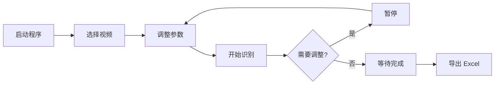

# WormTracker 用户说明书


> **版本**: v1.4.2 | **适用平台**: macOS / Windows |

---

## 目录

1. [产品简介](#1-产品简介)
2. [安装与环境配置](#2-安装与环境配置)
3. [快速上手](#3-快速上手)
4. [界面详解](#4-界面详解)
5. [完整操作流程](#5-完整操作流程)
6. [参数调节指南](#6-参数调节指南)
7. [配置文件说明](#7-配置文件说明)
8. [结果导出](#8-结果导出)
9. [常见问题](#9-常见问题)

---

## 1. 产品简介

WormTracker 是一套**自动化线虫计数工具**，专为微流控芯片中的线虫运动视频分析而设计。

### 它能做什么？

- 📹 导入显微镜拍摄的线虫视频（支持 .mp4 / .avi / .mov / .mkv 等格式）
- 🧠 自动识别微流控芯片中的各个通道
- 🔴 通过红色检测线，自动统计每条通道中通过的线虫数量
- 📊 实时显示计数结果，支持导出为 Excel 报告
- ⚙️ 提供丰富的可调参数，适应不同实验条件

### 核心特点

| 特点 | 说明 |
|------|------|
| **动态网格自适应** | 自动定位32路物理通道边界，无需手动标注 |
| **越线计数** | 红色检测线 + 黄色可调屏蔽范围，尽量保证计数准确 |
| **熔断保护** | 抵御设备震动或光照突变带来的干扰 |
| **实时预览** | 运行中可暂停、调参、查看检测效果 |
| **一键导出** | 结果导出为 .xlsx 格式，含视频名称与生成时间 |


---

## 2. 安装与环境配置（手动部署，可跳过不看）

### 2.1 系统要求

- **操作系统**: macOS 10.15+ 或 Windows 10+
- **Python**: 3.9 或更高版本
- **内存**: 建议 8GB 以上

### 2.2 安装步骤

#### 第一步：安装 Python

如果您尚未安装 Python，请访问 [python.org](https://www.python.org/downloads/) 下载并安装 Python 3.9+。

#### 第二步：创建虚拟环境（推荐）

打开终端（macOS）或命令提示符（Windows），依次执行：

```bash
# 创建 conda 环境（如果已安装 Anaconda/Miniconda）
conda create -n worm_env python=3.9 -y
conda activate worm_env

# 或者使用 Python 自带的 venv
python -m venv worm_env
# macOS/Linux:
source worm_env/bin/activate
# Windows:
worm_env\Scripts\activate
```

#### 第三步：安装依赖包

```bash
pip install opencv-python numpy pandas openpyxl pyyaml
pip install PyQt6 matplotlib
```

#### 第四步：验证安装

```bash
# 进入 WormTracker 目录
cd WormTracker/

# 启动程序
python main.py
```

如果看到 WormTracker 主窗口正常显示，说明安装成功。

---

## 3. 快速上手

如果您是第一次使用，按照以下步骤即可完成一次完整的线虫计数：

### 四步完成计数

```
① 打开视频  →  ② 调节检测线 →  ③ 开始识别  →  ④ 导出报告
```

#### ① 打开视频


1. 启动 WormTracker
2. 点击右侧面板的 **「📂 选择实验视频」** 按钮
3. 在弹出的文件对话框中，选择您的线虫实验视频文件
4. 视频画面将显示在左侧预览区
#### ② 调节检测线


1. 确认视频已加载后，点击 **「参数调节」** 按钮
2. 将红线调节至通道正中：
   - 🔴 **红色横线**：计数检测线
   - 🟡 **黄色线之间**：计数区，在此间识别线虫

#### ③ 开始识别


1. 确认视频已加载后，点击 **「▶ 开始识别」** 按钮
2. 系统将自动分析视频，左侧画面实时显示检测效果：
   - 🔴 **红色横线**：计数检测线
   - 🟡 黄点：检测到的线虫
   - 🔴 **红色竖线**：通道壁标记
3. 右侧面板实时更新各通道的计数值


#### ④ 导出报告


1. 视频分析完成后，点击 **「📊 导出 Excel 报告」** 按钮
2. 选择保存位置，系统将生成 .xlsx 文件
3. 用 Excel 或 WPS 打开即可查看完整计数结果

### 常用快捷键

| 快捷键 | 功能 |
|--------|------|
| **Space（空格）** | 暂停 / 继续分析 |

---

## 4. 界面详解

WormTracker 主界面分为三个区域：


### 4.1 左侧：视频预览区

- **初始状态**：显示「等待导入实验视频…」提示
- **加载视频后**：显示视频第一帧画面
- **分析进行中**：实时渲染检测效果（线虫框、检测线、屏蔽区等）
- **分析完成后**：自动切换为**柱状图**，展示各通道计数分布

#### 进度条

视频预览区下方的进度条用于显示分析进度。

### 4.2 右侧：控制面板（标签页切换）

#### 🎮 工作台

| 控件 | 说明 |
|------|------|
| **📂 选择实验视频** | 打开视频文件 |
| **▶ 开始识别 / ⏸ 暂停 / ▶ 继续** | 控制分析流程，按钮文字会根据状态动态变化 |
| **🔄 重新分析** | 从视频开头重新开始分析（仅在分析中显示） |
| **LCD 总数显示** | 实时显示当前统计的线虫总数 |
| **通道分布表格** | 每行显示「通道 ID」和对应的「计数」 |
| **📊 导出 Excel 报告** | 分析完成后导出结果 |
| **💾 保存当前配置** | 将当前的参数设置保存为 YAML 文件 |

#### ⚙️ 参数调节

详见 [第 6 章：参数调节指南](#6-参数调节指南)。

### 4.3 底部状态栏

| 按钮 | 功能 |
|------|------|
| **🌓** | 切换浅色 / 暗色主题 |
| **🔍** | 切换识别视角：查看模型检测到的前景/运动区域（二值化视图） |

状态栏左侧显示当前系统状态信息，如「✅ 系统就绪」「⏸ 已暂停」「✅ 分析完成」等。

---

## 5. 完整操作流程

### 5.1 标准流程



### 5.2 运行中调参

分析过程中，您可以随时：

1. 按 **Space** 暂停分析

2. 切换到 **「⚙️ 参数调节」** 标签页

3. 调整需要的参数（更改立即生效）

4. 按 **Space** 继续分析，观察调整后的效果

   

### 5.3 多视频批量处理

目前 WormTracker 不支持批量处理多个视频。如需处理多个视频，请逐个导入分析。每个视频分析完成后，请及时导出报告，因为导入新视频会清空之前的结果。

### 5.4 使用自定义配置文件

如果您有一套固定的实验参数，可以将其保存为配置文件，以后直接使用：

```bash
# 使用指定配置文件启动
python main.py -c my_config.yaml
```

也可以在 GUI 中点击「💾 保存当前配置」来保存。

---

## 6. 参数调节指南

参数调节是 WormTracker 使用中最关键的部分。合理的参数设置能显著提高计数准确率。

### 6.1 核心参数速查

| 参数 | 默认值 | 作用 | 何时调整 |
|------|--------|------|----------|
| **检测线高度** | 35%（距顶部） | 线虫越过此线时触发计数 | 线虫活动区域偏上或偏下时 |
| **Mask 上界** | 35%（距顶部） | 屏蔽画面上方的无效区域 | 画面顶部有干扰/文字时 |
| **Mask 下界** | 15%（距顶部） | 屏蔽画面下方的无效区域 | 画面底部有干扰/杂物时 |
| **墙壁遮罩半宽** | 5 px | 通道壁红色遮罩的宽度 | 通道壁附近有伪影时 |
| **虫体最小面积** | 100 px² | 过滤小于该面积的噪点 | 有灰尘等小颗粒被误检时 |

> 📐 **参数面板中显示的数值为「距顶部高度百分比」**，数值越大表示越靠近画面顶部。

### 6.2 检测线高度（红线位置）

检测线是一条横跨所有通道的红色水平线。线虫从**下方穿过红线到上方**时，会触发一次计数。

**调整建议**：
- 如果线虫主要在画面上半部分活动 → 将检测线调高（增大百分比值）
- 如果线虫主要在画面下半部分活动 → 将检测线调低（减小百分比值）
- 一般建议将检测线放在线虫主要活动区域的中间偏下位置

### 6.3 Mask 屏蔽范围

黄色线之外的域代表被屏蔽的部分，此区域内的运动目标**不会被计数**。

**典型场景**：
- 画面顶部有文字标注、时间戳 → 调大 Mask 上界
- 画面底部有芯片边缘、胶水痕迹 → 调小 Mask 下界（即增大屏蔽范围）

> 两个 Mask 值配合使用，可以精确定义有效的检测区域（上下界之间的部分）。

### 6.4 墙壁遮罩半宽

红色竖线标记通道壁的位置。增大此值会使红色遮罩变宽，更积极地排除墙壁附近的伪影。

**调整建议**：
- 如果墙壁边缘有光照反射被误检为线虫 → 适度增大此值
- 如果线虫紧贴墙壁活动被误排除 → 适度减小此值


### 6.5 虫体最小面积

这是一个噪点过滤器。任何面积小于此值的运动目标都会被忽略。

**调整建议**：
- 画面中有灰尘、小气泡被误检 → 增大此值（如 150~200）
- 线虫太小（幼虫、细线虫）被漏检 → 减小此值（如 50~80）

### 6.6 高级参数（通过 config.yaml 调整）

以下参数不在 GUI 中显示，需要编辑 `config.yaml` 文件来调整：

| 参数 | 默认值 | 说明 |
|------|--------|------|
| `num_channels` | 32 | 微流控芯片的通道数 |
| `bg_history` | 200 | 背景学习帧数。降低可更快遗忘静止物体 |
| `var_threshold` | 16 | MOG2 敏感度。越小越敏感，但也越容易引入噪点 |
| `max_dist_x` | 25 | 最大水平位移（防止跨通道误跟踪） |
| `max_dist_y` | 300 | 最大垂直位移（容忍线虫快速移动） |
| `cross_debounce` | 10 | 越线冷却帧数。降低可更快计数连续通过的线虫 |
| `init_frame_index` | 20 | 预热帧数。前 N 帧只学习背景，不计数 |
| `panic_noise_ratio` | 0.015 | 触发熔断的噪点比例阈值 |
| `cooldown_frames` | 30 | 熔断冷却帧数 |

> 💡 修改 `config.yaml` 后需要重新启动程序才能生效。

---

## 7. 配置文件说明

### 7.1 配置文件位置

默认配置文件为 WormTracker 目录下的 `config.yaml`。您也可以创建自己的配置文件，通过命令行指定：

```bash
python main.py -c /path/to/my_config.yaml
```

### 7.2 配置文件格式

配置文件使用 YAML 格式，是一个纯文本文件。您可以用任何文本编辑器（记事本、VS Code 等）打开编辑。

### 7.3 配置参数完整列表

```yaml
# ---- 后端选择 ----
backend: mog2              # 检测后端（目前仅支持 mog2）

# ---- 物理映射 ----
num_channels: 32           # 微流控芯片通道数 (1~100)
x_margin_left: 0.05        # 画面左侧裁剪比例
x_margin_right: 0.15       # 画面右侧裁剪比例
wall_ratio: 0.12           # 通道壁宽度比例
wall_refine: true          # 是否启用峰值精修（推荐开启）

# ---- 检测判定 ----
tripwire_ratio: 0.65       # 检测线高度 (0=顶部, 1=底部)
min_area: 100              # 虫体最小像素面积
max_area: 4500             # 虫体最大像素面积
mask_top_ratio: 0.35       # 屏蔽区域上界
mask_bottom_ratio: 0.85    # 屏蔽区域下界

# ---- MOG2 背景建模 ----
bg_history: 200            # 背景学习历史帧数
var_threshold: 16          # 背景模型敏感度
init_frame_index: 20       # 预热帧数

# ---- 追踪策略 ----
max_dist_x: 25             # 最大水平位移
max_dist_y: 300            # 最大垂直位移
track_history_len: 100     # 轨迹历史最大长度
cross_debounce: 10         # 越线冷却帧数

# ---- 熔断保护 ----
panic_noise_ratio: 0.015   # 噪点比例阈值
grid_mutation_tolerance: 0.15  # 网格突变容忍度
cooldown_frames: 30        # 熔断冷却帧数

# ---- 墙壁遮罩 ----
wall_mask_margin: 3        # 墙壁向内侵蚀像素
wall_peak_half_width: 5    # 峰值精修墙壁红线半宽 (px)

# ---- 输出 ----
export_format: xlsx        # 导出格式: xlsx | csv
```

---

## 8. 结果导出

### 8.1 导出步骤

1. 等待视频分析完成（状态栏显示「✅ 分析完成」）
2. 点击 **「📊 导出 Excel 报告」** 按钮
3. 选择保存路径和文件名
4. 系统自动生成 .xlsx 文件

### 8.2 报告内容

导出的 Excel 文件包含两个工作表：

#### Sheet 1：计数结果

| 行 | 内容 | 示例 |
|----|------|------|
| 第 1 行 | 视频名称 | 视频名称：experiment_01.mp4 |
| 第 2 行 | 生成时间 | 生成时间：2026-05-28 14:30:00 |
| 第 4 行起 | 通道编号 + 计数值 | Channel 1 / 15 |
| 末行 | 总计 | Total / 480 |

#### Sheet 2：实验信息

包含视频名称、生成时间、使用的检测后端等元信息。

### 8.3 注意事项

- ⚠️ **在分析完成前导出按钮不可用**，请等待分析结束
- ⚠️ **导入新视频会清空之前的结果**，请及时导出
- 📂 导出格式可在 `config.yaml` 中设置为 `xlsx` 或 `csv`

---

## 9. 常见问题

### Q1：线虫计数明显偏少（漏检）

可能原因及解决方案：

| 原因 | 解决 |
|------|------|
| 虫体太小被过滤 | 减小「虫体最小面积」参数 |
| 检测线位置不合适 | 调整检测线高度 |
| 线虫在屏蔽区内活动 | 调整 Mask 上界/下界 |
| 背景模型不够敏感 | 减小 `config.yaml` 中的 `var_threshold` |

### Q2：计数明显偏多（误检）

可能原因及解决方案：

| 原因 | 解决 |
|------|------|
| 灰尘/气泡被误检 | 增大「虫体最小面积」参数 |
| 通道壁反光被误检 | 增大「墙壁遮罩半宽」 |
| 画面边缘有干扰 | 增大 Mask 屏蔽范围 |

### Q3：通道识别不正确

**现象**：红色竖线没有对准实际的通道壁。

**解决**：
1. 确认 `config.yaml` 中 `num_channels` 设置正确
2. 确认 `wall_refine: true`（峰值精修已开启）
3. 尝试调整 `x_margin_left` 和 `x_margin_right`（画面裁剪比例）
4. 确认视频中芯片没有严重倾斜

### Q4：如何调整通道数？

该参数一般也不做调节。通道数 `num_channels` 需要通过编辑 `config.yaml` 文件来修改，GUI 中不提供此参数的调节。修改后重启程序即可生效。

### Q5：支持哪些视频格式？

WormTracker 基于 OpenCV，支持大多数常见视频格式：
- ✅ .mp4、.avi、.mov、.mkv、.wmv
- ✅ 任何 OpenCV 能解码的格式


---

## 附录 A：快捷键参考

| 快捷键 | 功能 |
|--------|------|
| Space | 暂停 / 继续分析 |

## 附录 B：命令行参数

```bash
# 基本用法
python main.py

# 指定配置文件
python main.py -c my_config.yaml
python main.py --config /path/to/config.yaml

# 模块方式运行
python -m wormtracker
```

## 附录 C：技术支持

如遇到本说明书未涵盖的问题，请：

1. 检查 `config.yaml` 配置是否正确
2. 确认 Python 版本 ≥ 3.9
3. 确认所有依赖包已正确安装

---

> 📝 文档版本：v1.0 | 适用 WormTracker v1.4.2 | 最后更新：2026-05-28
